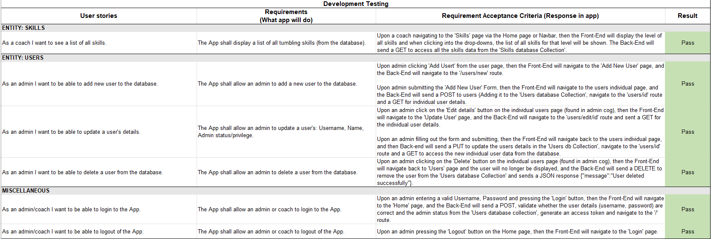
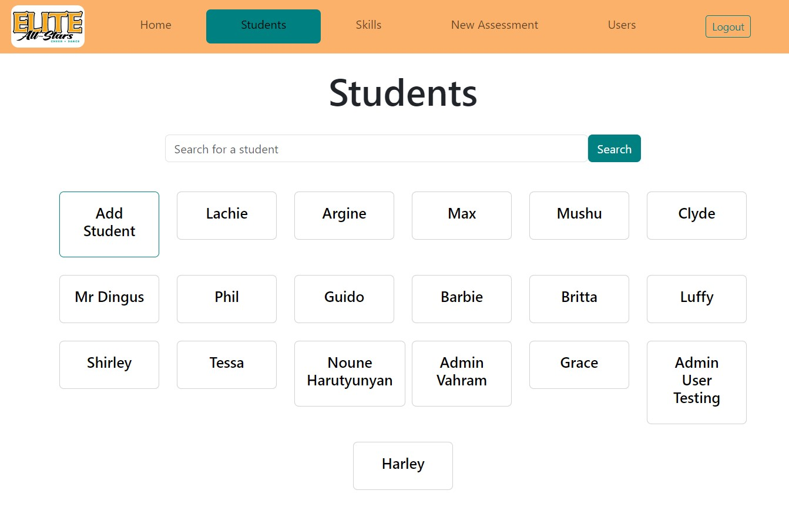

# T3A2-A - Full Stack App

## Maximillian Pichlmann, Lachlan Peterson, Argine Harutyunyan

### Contents
### Part A 
- [R1 Description of website](#r1-description-of-website)
- [R2 Dataflow Diagram](#r2-dataflow-diagrams)
- [R3 Application Architecture Diagram](#r3-application-architecture-diagram)
- [R4 User Stories](#r4-user-stories)
- [R5 Wireframes for multiple standard screen sizes](#r5-wireframes-for-multiple-standard-screen-sizes)
- [R6 Trello Board](#r6-trello-board)

[Part A GitHub Repo](https://github.com/LachlanPeterson/TST-Planning)

### Part B 

## [R10 Link to Deployed App](https://tumbleskillstracker.netlify.app/)

### Login Details for Non-Admin User
#### Username: elitecoach
#### Password: foobar

- [R8 Evidence of User Testing](#r8-evidence-of-user-testing)
- [R9 Formal Testing Framework](#r9-formal-testing-framework)
- [R13 Trello Board](#r13-trello-board)

# PART A

# R1 Description of website

**Client**: Elite All-Stars Cheer & Dance

**Web Application**: Tumbling Skills Tracker

Tumbling is a physical activity in which athletes perform various skills or acrobatic movements - cartwheels, flips, rolls, twists and somersaults - by either running to gather forward momentum into a skill (running tumbling) or standing still to jump certain skills (standing tumbling). The most recognizable form of Tumbling is when gymnasts perform floor routines on sprung floors, however it is also popular and a prerequisite for competitive cheerleading.  

Our client, Elite Allstars, specialises in Tumbling for Cheerleaders and teaches a range of different age groups from 5 years old and above within both recreational and competitive programs. There are a variety of different levels of both cheerleading and tumbling skills. Skills can range from beginner friendly skills like a handstand in Level 1, all the way to a double full twisting layout in Level 6. Because of the physical & injury-prone nature of the sport, an athlete’s progression must be meticulously tracked through term assessments. These assessments are designed to test tumbling athletes on a wide range of skills to accurately monitor individual skill & progression.  

Collating the data received from assessments can impact business significantly and help guide both trainers and athletes in their decision-making process regarding growth. Athletes will benefit from having a robust history of their assessment scores tracked. By precisely tracking an athlete's growth, coaches will be able to easily identify weak spots or inconsistencies efficiently and give further, more specialized feedback. Coaches will also benefit from the time saved in class when conducting assessments. Furthermore, if questioned on their decision making regarding an athlete's improvement/growth, coaches  will have access to the stored data, allowing them to justify any decisions regarding skill level. Owners will also benefit from the ability to analyse data from assessments across the board to highlight weak spots in the curriculum, or areas where the coaching staff might need further education.  

Elite Allstars has developed a specific tumbling curriculum to track the progress of athletes as they grow in ability. The term and annual tumble class lesson plans are built based on the assessments conducted within this curriculum to continually provide a safe and supportive environment for the athletes attending. Currently, Elite Allstars conduct assessment tests regularly, at the end of every term to track an athlete's skills progression. However, the current iteration of the tracking process - or way to record athlete's progression - is not only manual and is also vastly inefficient. 

Currently in place is a manual-tracking process where: 
- The owner provides a list of all athletes in all classes to the head tumble coach; 
- The head coach will note the current skill level of each athlete (if previously known); 
- The head coach will put together personalized assessments for each athlete and individually print these documents; 
- The head coach / owner will organize the physical assessment rubric into class times to give to the class coach; 
- The class coach will then receive the copies of assessment, handwrite all the athletes results, and return the assessments to the head coach / owner; 
- The head coach will manually input data to analyse scores in excel; and  
- The process is repeated at the end of each term (approx. every 10 weeks). 

With a smaller client base of athletes, this process was more deemed to be manageable. However, as the business has now grown to train over 150 athletes, with multiple coaches tracking their constant progression and improvements weekly, the current improvement tracking process must be improved. Not only is there a large amount of room for error, but there is no system in which data can be easily tracked, especially when conducting individual term assessments.   

Therefore, the following application aims to solve this problem. The Tumbling Skills Tracker – as the name suggest – is a web application that allows coaches and educators at Elite Allstars to track a tumbling athletes’ individual skills progression when conducting term assessments. This website provides a solution by making the individual skills progression of all students easily accessible for coaches. The staff at Elite Allstars will be able to logon to our website to view, edit, delete, or add any student information such as basic info, tumbling skills progression, and assessment scores. They will also be able to create new assessments each semester for specific individual students based off their personal skills progress. Thus, solving the problem by automating the record keeping process and transferring it online to our website by enabling a database to store information rather than a filing cabinet at Elite Allstars. In-turn this would allow for the precise tracking of any students tumbling skills progression - during term assessments or otherwise – which saves valuable time in class and allows coaches to easily review specific athletes progress over time.    

 

### Functionality/Features 

Log in required 
- Ensure security of sensitive information such as student names by requiring authentication to access any database information 
- Ensure no misuse of power by enabling authorization on certain actions 

Add coach users (Admin only) 
- Add new user to provide access for coaches 
- Update Admin property 
- Delete users to restrict access when needed 

Store student details 
 - Student details such as name can be stored alongside assessment results to easily access a full history of assessments for each student. 

Create student-specific assessments tracking skill level for multiple skills 
- Assessments can be created and auto-populated with the appropriate level skills 
- Assessments record the student, date of assessment, and user that conducted the assessment. 
- Store score for each skill in assessment 

View all students 
- See all students in database 

Search for student 
- Search database of students by name 
- See single student record with associated assessment records 
- Update or delete student record (Admin only) 

See specific assessment record 
- See single assessment record via associated student. 
- Update of delete assessment record (Admin only) 

View all skills 
- See all skills within database and the associated level. 

 

### Target Audience 

Cheerleading / gymnastics coaches and business owners 

 

### Tech Stack 

**MongoDB** 

MongoDB is a popular open-source, document-oriented NoSQL database. Documents store data in a JSON-like format, and are grouped into collections. MongoDB is designed to be flexible and scalable, making it ideal to handle the structure of data required within this app with the assurance that an increase in volume won’t cause issues.  

**Express.js**

Express is a lightweight web application framework for Node.js, providing features to build web applications and API’s. Express is often used to build RESTful API’s with built in methods for routing and handling HTTP requests, and will be used to handle server-side logic in this application. 

**React.js**

React is an open-source JavaScript library for building user interfaces and components. It is developed and maintained by Meta. React is commonly used to build single-page applications (SPAs) and complex frontend applications.  

**Node.js** 

Node.js is an open-source, server-side JavaScript runtime environment, allowing execution of JavaScript code on the server. Node.js comes with the default package manager npm (Node Package Manager), which provides access to the many third-party modules and libraries that have been published to easily integrate these into the application. 

**Third Party Packages used in this application via npm include:** 

*jsonwebtoken* – to allow use of JWT authorization to access the app 

*bcrypt* – to securely store sensitive information (user passwords) as a hash 

[Back to top](#t3a2-a---full-stack-app)

# R2 Dataflow Diagrams

All dataflow diagrams will follow this key:

## Login/Authorization

1. The website login page presents users with a form to input their login details, which will submit a post request to the backend to check if the supplied details belong to a user which exists in the database.  
2. The server receives the request and executes the Login function which checks if the supplied details match a user’s login details in the database.  
3. If the details do not match a user’s login details in the database an error is returned.  
4. If the details match a user’s login details in the database they are passed to the createJWT function.  
5. A JWT is then created and associated with the user that matches the provided user login details.  
6. The login details which have been verified as well as the associated JWT are then returned to the front end 

## Create/Update/Delete Student  

1. User arrives at login page and is prompted to enter their username and password 
2. User details are sent to the database and checked in order to authenticate the login attempt 
3. If the user exists and the details are correct the user is logged in 
4. The home page will now render after a successful login  
5. From the home page the user selects ‘Students’ 
6. The user is prompted to select a student from the page which is populated by data supplied by the student database collection, or if the user is an admin they can create a new student  
7. If the user is an admin they are given the option to create a new student, edit student details or delete a student. Either changes made to the student are made and sent to the database, a new student is created and sent to the database, or the selected student is deleted from the database.   

## New Assessment

1. User arrives at login page and is prompted to enter their username and password 
2. User details are sent to the database and checked in order to authenticate the login attempt 
3. If the user exists and the details are correct the user is logged in 
4. The home page will now render after a successful login  
5. From the home page the user selects ‘New Assessment’ 
6. The user is prompted to select a student and assessment level for the new assessment, the user’s options to choose from is supplied by the student database collection and the skills database collection respectively.  
7. The user carries out the assessment, grading the student on each skill that has now populated the assessment form. 
8. The assessment is submitted with all required data being sent to the assessment database collection.  

## Update/Delete Assessment

1. User arrives at login page and is prompted to enter their username and password 
2. User details are sent to the database and checked in order to authenticate the login attempt 
3. If the user exists and the details are correct the user is logged in 
4. The home page will now render after a successful login  
5. From the home page the user selects ‘Students’ 
6. The user is prompted to select a student from the page which is populated by data supplied by the student database collection 
7. On the specific students page the user can select from a range of assessments associated with that student which are supplied by the assessment database collection.  
8. If the user is an admin they have the ability to update or delete a selected assessment. If they update an assessment those changes are made and the updated assessment is sent back to the database, if they choose to delete the assessment the assessment is deleted from the database.  

## View Skills

1. User arrives at login page and is prompted to enter their username and password 
2. User details are sent to the database and checked in order to authenticate the login attempt 
3. If the user exists and the details are correct the user is logged in 
4. The home page will now render after a successful login  
5. From the home page the user can select ‘skills’ to view a list of skills  
6. A list of skills is supplied by the skills database collection and displayed on the page 

## Create/Update/Delete User

1. User arrives at login page and is prompted to enter their username and password 
2. User details are sent to the database and checked in order to authenticate the login attempt 
3. If the user exists and the details are correct the user is logged in 
4. The home page will now render after a successful login  
5. From the home page if the user is an admin, they can then select ‘Users’ to view users 
6. The user is prompted to select a user from the page which is populated by data supplied by the user database collection, or they can create a new user. 
7. The user given the option to create a new student, edit user details or delete a user. Either changes made to the user are made and sent to the database, a new user is created and sent to the database, or the selected user is deleted from the database.   

[Back to top](#t3a2-a---full-stack-app)

# R3 Application Architecture Diagram

1. Users interact with the front end, built with React, utilising the underlying technologies of HTML, CSS and JavaScript in conjunction with Vite and bootstrap. 

2. As the users make use of functionality on the front end, requests are sent to the API, which is built with Express and utilises mongoose and node.js. These requests involve the API then retrieving and querying data from the database, wherein an appropriate response is sent back to the front end.  

3. The database is managed by MongoDB and hosted using Atlas. Several database collections are used to store the necessary information, with these collections being manipulated by the CRUD functionality that is provided by the API.  

[Back to top](#t3a2-a---full-stack-app)

# R4 User Stories

Given the client requirements and time frame for this project, the users identified for this app are: 

**Admin** – The owner of the business, and head of the coaching program that require the highest-level access within the app. 

**Coach** – Employee’s of the business that require access to the app. Coach users will not have all available permissions granted, but the necessary access required to input and edit data in the database as required. 

To ensure that all requested functionalities will be covered, the required database entities were identified, and the appropriate user stories created to cover all entities. The scope of the application was larger than initially anticipated, and as such user stories were refined, prioritized, and a minimum viable product (MVP) was planned with optional extended scope for ‘nice to have’ features as the lowest priority. 

Implementation sequencing key: 

- HP – High Priority 
- MP – Mid Priority 
- LP – Low Priority     
- ES – Extended scope 

|   |   |
|---|---|
|ENTITY: |STUDENTS   |
|Sequencing|User Story|
|HP|As an admin I want to store sensitive student information securely.|
|HP|As an admin I want to be able to add new students to the database|
|MP|As a coach I want to be able to view all the current students at the gym|
|MP|As an admin I want to be able to delete a student from the database|
|LP|As an admin I want to be able to update a student’s details|
|ES|As a coach I want to view the current level of a student|
|ES|As a coach I want to filter students by level|

|   |   |
|---|---|
|ENTITY: |ASSESSMENTS   |
|Sequencing|User Story|
|HP|As a coach I would like to be able to carry out a new assessment on a student|
|MP|As a coach I would like to be able to view all the assessments for a given student|
|MP|As an admin I would like to be able to delete an assessment|
|LP|As an admin I would like to be able to amend an assessment where a mistake may have been made|
|ES|As a coach I want to add feedback to each skill using technique points|
|ES|As an admin I want to compare data from different assessments|

|   |   |
|---|---|
|ENTITY: |SKILLS   |
|Sequencing|User Story|
|HP|As a coach I want to see a list of all skills|
|LP|As a coach I want to see the name and description of a single skill|
|ES|As a coach I want to see all related technique points to a skill|
|ES|As an admin I want I want to add skills or custom technique points|

|   |   |
|---|---|
|ENTITY: |USERS   |
|Sequencing|User Story|
|HP|As an admin I want to add/update/delete users|
|MP|As an admin I want to grant admin privileges|
|ES|As a user I want to be able to reset my password|

[Back to top](#t3a2-a---full-stack-app)

# R5 Wireframes for multiple standard screen sizes

*Note: All unannotated wireframes can be found in `/docs/wireframes`*

## Site Map Overview

## Entry Point – Login Page
**User Story**: As an admin I want to store sensitive student information securely.

Many students are underage and will have legal names as a part of the database. This means it is of utmost importance that there is adequate authorization and authentication right from the entry point of the app to ensure this information is secured and only the allowed parties will be able to access.

## Entry Point – Login Page (Tablet/Mobile view)

## Home Page
Though not directly linked to a user story, the home page provides clear links via Navbar & cards to access functionalities noted in higher priority user stories.

## Home Page (Tablet/Mobile view)

## Students Page
**User Story**: As a coach I want to be able to view all the current students at the gym.

## Students Page (Tablet/Mobile view)

## Student Profile 
**User Story**: As a coach I would like to be able to view all the assessments for a given student 

## Student Profile (Tablet/Mobile view)

## New Assessment Page
**User Story**: As a coach I would like to be able to carry out a new assessment on a student.

## New Assessment Page (Tablet/Mobile view)

## Skills Page
**User Story**: 
-	As a coach I want to see the name and description of a single skill 
-	As a coach I want to see a list of all skills 

## Skills Page (Tablet/Mobile view)

## Users Page 
**User Story**: As an admin I want to add users 

## Users Page (Tablet/Mobile view)

## User Profile
**User Story**:
-	As an admin I want to grant admin privileges 
-	As an admin I want to update/delete users 

## User Profile (Tablet/Mobile view)

## Visual Sitemap

[Back to top](#t3a2-a---full-stack-app)

# R6 Trello Board

[Link to Part A Trello Board](https://trello.com/b/1d6FfjPa/part-a)

To plan, organize, and track the project, a trello board was created and all members of the project added.

Columns are created for each of the following:
- **On hold**: If there is an issue, blocker, or a card needs to be put on hold for a time it will be put in this column.
- **Next up**: Meeting cards that are coming up are put in this column.
- **Current Sprint**: All tasks that need to be completed in the current sprint have cards in this column.
- **In Progress**: Cards that are are actively being worked on will be in this column.
- **Questions**: If any questions arise while a card is In Progress, it can be moved here so other team members can review.
- **Done**: When a card is complete it is moved to this column.

All requirement cards start in Current Sprint, until they are allocated to a team member, where a flag will be put on the card and it will be moved to In Progress.

All planned meetings will have a new card created in Next Up. These cards will have planned agenda notes, with additional comments about actions post meeting.

Following the first group meeting, several set up actions were assigned to begin the project.

This includes allocation of discussed tasks once the trello board was set up.

Once tasks are assigned, the group would keep in communication with various methods such as:

Commenting on relevant trello cards to provide updates

Communicating via group Discord creating relevant channels as the need arises, and voice calls to conduct planned meetings.

 
Posting daily stand-ups to the Coder Academy discord

Additional screenshots of trello board management throughout the project:

*16/08/23*

*17/08/23*

*18/08/23*

[Back to top](#t3a2-a---full-stack-app)

# PART B 

## [R10 Link to Deployed App](https://tumbleskillstracker.netlify.app/)

### Login Details for Admin User
#### Username: eliteadmin
#### Password: spameggs

### Login Details for Non-Admin User
#### Username: elitecoach
#### Password: foobar

[R11 Link to Front End Repo](https://github.com/arharutyu/Tumble-Skills-Tracker)

[R11 Link to Back End Repo](https://github.com/mpichlmann/T3A2-Backend)

# R8 Evidence of User Testing

## Development Environment

Prior to deployment of the live website, the following testing rubric was used to ascertain if the app had reached full functionality, and could be considered 'complete'. 
## Testing of Student Functionality

## Testing of Assessment Functionality

## Testing of Skills, Users, and Misc Functionality

## Production Environment 

Once the aformentioned tests had all passed in the development environment, the app was subjected to user testing in the production environment. Users were presented with the following rubric wherein they could make comments and assess app features and functionality. 

Screenshots of testing rubric that was filled out by various users in production environment: 

## User 1

## User 2

## User 3

Once users had completed their testing rubrics, us developers marked which changes were to be made, and revisited the testing rubrics to update progress on the necessary changes. After presenting the deployed application to our selected users for testing, the following changes were made to further improve functionality, navigation and understanding of the app: 

## Logout button moved to navbar

### Before: 

### After: 

## More distinct colouring on add student / add user card

### Before: 

### After: 

## Loading messages while waiting for API calls (specifically for create new assessment route when getting student and - level)

### Before: 

### After: 

## Skill score key included on student profile & new assessment pages

### Before: 

### After: 

These changes were made and pushed to the latest deployed release version of the application. 

[Back to top](#t3a2-a---full-stack-app)

# R9 Formal Testing Framework

## Front End Testing Coverage Report

## API Testing Coverage Report 

[Back to top](#t3a2-a---full-stack-app)

# R13 Trello Board

[Link to Part B Trello Board](https://trello.com/b/gMOtgmQ6/app-plan)

At the outset of the planned project, the Trello board was set up with our user stories in mind, so that we could ensure that full functionality would be achieved. These user stories retained their priority status that was determined in Part A so that development of the most critical features would be guaranteed. 

Throughout the development of the app, many meetings were had in order to discuss our teams relative strengths and weaknesses, and to appropriately assign tasks. As a result of these meetings we very early on in development began to assign team members to specific cards on our Trello board. 

As development got underway, the Trello board expanded, and we started incorporating cards that were specifically focused on key app functionalities. Cards became tailored to specific database entities and the routes those entities could be accessed from, both from the front end user interface, and through the back end API. These more focused cards were linked to their respective user stories. 

In order to ensure high quality work being produced, before a card could be moved to the 'Done' section, the relevant code related to that card would be checked by other team members. This ensured that correct code practice was followed, as well as guaranteeing that the code worked on multiple machines. 

Through the use of adequately set up cards that were properly assigned to team members based off respective strengths and weaknesses, progress on the development of the app proceeded smoothly. 

Through frequent (almost daily) team meetings over voice chat in our team discord, we were able to effectively plan and allocate tasks in order to development a fully functioning app, resulting in a trello board that looked like this: 

[Back to top](#t3a2-a---full-stack-app)

# Stand ups 

Throughout the development of the App our team participated in daily stand ups. First we would have a group stand up in our team discord channel, usually as our final point of discussion in one of our many team meetings over voice, where we would share with each other what we had accomplished, what we were struggling with, what we planned to do next, and what we had learned. Next we would then collate our individual stand ups into a single stand up that we could post in the Coder Academy discord channel for team stand ups. Below are all of our stand ups throughout the development process. 

*21st August Standup*

*22nd August Standup*

*23rd August Standup*

*24th August Standup*

*25th August Standup*

*28th August Standup*

*29th August Standup*

*30th August Standup*

*31st August Standup*

*1st September Standup*

[Back to top](#t3a2-a---full-stack-app)
